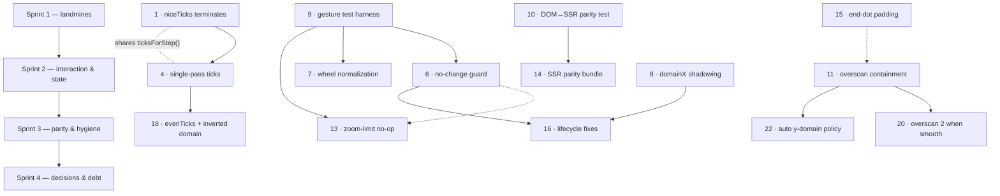

<!--
GENERATED ANALYSIS — @marianmeres/trend-chart — synthesis and roadmap
Produced 2026-08-12 by multi-agent review (8 dimension reviewers) → adversarial verify
(one refutation agent per finding, most with empirical `deno eval` repros) → synthesis.
Claims verified against the codebase at commit e06fdea. Planning artifact; no code was changed.
-->

# @marianmeres/trend-chart — Review Fixes: Overview & Roadmap

> **The architecture is right and nothing here asks you to change it.** The pure-`Scene` core
> with two thin renderers holds up under scrutiny; the module boundaries in `AGENTS.md` are
> real and respected; the suite is green and the publish gates are clean. What the review found
> is a set of _defects inside a good design_ — 33 of them, all verified against the code, most
> with a reproduction.
>
> **Four of them are landmines and the rest are not.** `niceTicks()` can loop forever and freeze
> the tab or hang an SSR process. `sceneToString()` interpolates three color options into markup
> unescaped. A zone gradient paints a wrong-color blend across the whole plot whenever the domain
> top edge lands on a boundary. And the y axis silently leaves its own top bound unlabeled on
> ~5% of integer ranges. These four have nothing in common except that each produces output that
> is _confidently wrong_ rather than obviously broken — which is why they survived to now.
> They are Sprint 1.
>
> **Everything else clusters into three recurring themes**, and the sprints are organized around
> them rather than around files. _Overscan leaks_: the one-point padding that keeps the line
> continuous also leaks into the hit-test list, the end-dot check, and the auto y-domain fit —
> three bugs, one shape of fix. _Missing change-detection_: no path compares a new domain
> against the current one, which turns the obvious two-chart sync idiom into infinite recursion
> and makes edge-drags fire a callback per pointermove. _Renderer drift_: five small places
> where the DOM and SSR consumers disagree, all invisible until someone server-renders and
> hydrates.
>
> **How to read this.** Sprint 1 below is the only part that is urgent. Sprints 2 and 3 are
> ordinary correctness work that can proceed at any pace. Sprint 4 is deliberately last because
> every item in it needs a decision from you before code is written — including the two most
> user-visible behavior changes in the whole plan (the scroll-capture policy and the `"auto"`
> y-domain fit). Track execution in [`PROGRESS.md`](./PROGRESS.md); the per-finding detail,
> evidence and sketch code live in the numbered docs.

## Top recommendations across all dimensions (ranked)

| Rank | Recommendation                                                            | Dimension (doc)                        | Value | Effort | Risk | Why now                                                                      |
| ---- | ------------------------------------------------------------------------- | -------------------------------------- | ----- | ------ | ---- | ---------------------------------------------------------------------------- |
| 1    | `niceTicks()` terminates — generate ticks by index, not accumulation      | [01](./01-core-math.md) #1             | high  | S      | low  | Hangs the browser tab / SSR process; reachable with default options          |
| 2    | Escape the 3 unescaped color sinks in `sceneToString()`                   | [04](./04-ssr-and-parity.md) #1        | high  | S      | low  | Markup injection wherever colors are user-supplied                           |
| 3    | Fix the zone gradient when the domain top edge equals a boundary          | [01](./01-core-math.md) #2             | high  | S      | low  | Whole plot renders a wrong-color blend; default `domainY: "full"` reaches it |
| 4    | Derive y domain and y ticks from a single `niceDomain()` pass             | [01](./01-core-math.md) #3             | high  | M      | med  | Axis bound left unlabeled on ~5% of ranges; blocks other tick work           |
| 5    | Define a non-finite sample policy instead of emitting `NaN` into the path | [02](./02-scene-composition.md) #1     | high  | M      | med  | One bad sample silently truncates the line; gappy data is common             |
| 6    | Guard `#applyDomain` against no-change domains                            | [03](./03-interaction.md) #1           | high  | S      | low  | Two-chart sync recurses infinitely; event storm on every edge drag           |
| 7    | Normalize wheel input (ignore `deltaY === 0`, scale by magnitude)         | [03](./03-interaction.md) #2           | high  | M      | low  | Horizontal trackpad swipe zooms in and eats the page scroll                  |
| 8    | Fix `domainX` shadowing (`resetDomain` / `setOptions`)                    | [05](./05-api-surface.md) #1           | high  | S      | low  | Two documented behaviors are silently wrong; one root cause                  |
| 9    | Build a headless gesture-test harness                                     | [06](./06-tests-and-tooling.md) #1     | high  | M      | low  | `gestures.ts` produced 3 bugs with 0 tests; needed _before_ fixing them      |
| 10   | Add a DOM↔SSR parity test                                                 | [06](./06-tests-and-tooling.md) #2     | high  | M      | low  | 5 of 6 parity findings are one class a single test would catch               |
| 11   | Contain the overscan leaks (hit-test + end dot)                           | [02](./02-scene-composition.md) #2, #3 | med   | S      | low  | Hover/click fire for out-of-view points; end dot draws outside the svg       |
| 12   | Reconcile the hover dot on re-render                                      | [03](./03-interaction.md) #4           | med   | S      | low  | Dot sticks 40–100px from the line after any zoom                             |
| 13   | Zoom-in at `minDomainSpan` becomes a no-op, not a slow pan                | [03](./03-interaction.md) #3           | med   | S      | low  | Window drifts under the cursor at the zoom limit                             |
| 14   | SSR parity bundle: `class`, markers, font var, offsets, `display:block`   | [04](./04-ssr-and-parity.md) #2–#6     | med   | M      | low  | SSR-then-hydrate flickers; documented CSS hooks miss one renderer            |
| 15   | Include the end-dot extent in the default padding                         | [02](./02-scene-composition.md) #4     | med   | S      | low  | `{endDot: true}` is _always_ clipped at the svg edge                         |
| 16   | Lifecycle fixes: `update()` event, `minDomainSpan: 0`, ResizeObserver     | [05](./05-api-surface.md) #2–#4        | med   | S      | low  | Three independent silent contract violations                                 |
| 17   | Pointer hygiene: primary-button guard, null-scene guard                   | [03](./03-interaction.md) #5, #6       | med   | S      | low  | Middle-click fires `onPointClick`; gestures throw on a 0-size container      |
| 18   | Snap and dedupe `evenTicks()`; normalize inverted domains                 | [01](./01-core-math.md) #4, #5         | med   | S      | low  | Float-noise labels; inverted `domainY` drops every label                     |
| 19   | Cover the three `domainY` modes + hostile-input tests                     | [06](./06-tests-and-tooling.md) #3, #4 | med   | S      | low  | The block rank 4 rewrites has no direct coverage                             |
| 20   | `overscan: 2` when `smooth` is on                                         | [02](./02-scene-composition.md) #5     | med   | S      | low  | Curves visibly pop at plot edges while panning                               |
| 21   | Decide the scroll-capture policy                                          | [03](./03-interaction.md) #7           | med   | M      | med  | Chart traps page scroll by default; needs a product call                     |
| 22   | Decide whether `"auto"` y-domain fits overscan points                     | [02](./02-scene-composition.md) #6     | med   | S      | med  | Out-of-view spike flattens the visible series; most visible change           |
| 23   | Keep marker/hover/end-dot colors themable in zones mode                   | [02](./02-scene-composition.md) #7     | low   | S      | low  | `--trend-chart-line` silently stops applying when zones are set              |
| 24   | Pass `[]` not `[""]` to `versionizeDeps`                                  | [06](./06-tests-and-tooling.md) #5     | low   | S      | low  | Pointless `npm install ""`; published output is already correct              |

**Deliberately omitted.** The review's verification stage capped at 6 findings per dimension, so
7 lower-ranked items (5 from api-design, 1 each from ssr-parity and dom-renderer) were never
adversarially checked and are **not** carried into this plan — including them unverified would
break the "verified, not vibes" rule. They are recoverable from the raw workflow output if
wanted. Separately, no finding was dropped for being low-value after verification: of 40
confirmed findings, 33 remain after deduplicating cross-dimension overlap (the SSR escaping
issue was found independently by three reviewers, the end-dot overscan by two, and so on).

## Recommended first sprint (do these 5 first)

**1. `niceTicks()` termination ([01](./01-core-math.md) #1).** The only defect in the package
that can hang a process. The fix is a loop rewrite from accumulation to indexing — half a dozen
lines — and it incidentally removes the additive float drift that `snap()` exists to paper over.
It also produces the `ticksForStep()` helper that rank 4 needs, so doing it first makes the
harder tick fix cheaper. Ship with a bounded-length assertion so a regression fails CI instead
of hanging it.

**2. Escape the SSR color sinks ([04](./04-ssr-and-parity.md) #1).** Three raw interpolations
into `style` attributes, in a file that escapes correctly everywhere else. The fix is wrapping
three expressions in the existing `esc()`, plus routing all color output through one helper so
the next sink cannot regress. It is first because it is the only security-shaped finding, and
because it costs almost nothing.

**3. Zone gradient at a boundary-equal domain edge ([01](./01-core-math.md) #2).** A visibly
wrong render — the entire line and fill become a two-color blend that contradicts the background
bands drawn right behind them. Reachable by default, because `domainY` defaults to `"full"` when
zones are configured and real datasets do land on their own zone boundaries. A small
edge-aware variant of `zoneColorAt` fixes it without touching the exported function's contract.

**4. Single-pass tick derivation ([01](./01-core-math.md) #3).** The highest-risk item in the
sprint and the reason the sprint is five items rather than four: it changes which ticks appear
on ~5% of ranges, so it wants care and existing-test vigilance. It is grouped here because it
shares `ticksForStep()` with item 1 and because leaving an axis bound unlabeled is a
correctness bug in a charting library, not a polish item.

**5. Non-finite sample policy ([02](./02-scene-composition.md) #1).** Currently a single `NaN`
makes half the line vanish with no error and a perfectly normal-looking axis. Sprint 1 ships the
one-line "drop non-finite points" policy (option A); the richer "break the path into gap
segments" version is a considered follow-up, not a prerequisite. The care needed is in
preserving `ScenePoint.index` as an index into the _full_ dataset while filtering.

**Sequencing note:** items 1, 3 and 4 all live in `ticks.ts`/`zones.ts`/`scene.ts` and can be one
branch with one commit each; item 2 is independent and can land in parallel.

## Cross-cutting themes

**Overscan leaks (3 findings, 2 docs).** `visibleSlice(points, domainX, overscan = 1)` is a good
idea — one extra point per side keeps the clipped line continuous while panning. But the padded
slice is then consumed unfiltered by three things that meant "visible": the hit-test list, the
end-dot's is-this-really-last check, and the `"auto"` y-domain fit. Each fix is a domain filter
at the point of use, and the underlying lesson is that `Scene.visible`'s JSDoc ("All visible
points") is what made the leaks look safe.

**Nothing detects "no change" (3 findings, 2 docs).** Neither `#applyDomain`, nor the gesture
callers, nor `#setHover`'s visual path compares new state against current state. This produces
an infinite recursion, a per-pointermove event storm, and a hover dot stuck at stale
coordinates. All three want the same discipline: compare, then act.

**Renderer drift (6 findings, 1 doc).** `AGENTS.md` states the rule — new visual features go
into _both_ consumers — but nothing enforces it, so five renderer-visible details exist in one
consumer only. This is the theme most worth fixing structurally (a parity test) rather than
item by item.

**Docs promise more than the code delivers (7 findings, 4 docs).** `resetDomain`, `setOptions`,
`onDomainChange`, `minDomainSpan: 0`, `endDot` hiding, the `class` option, `--trend-chart-font`
— in each case the documented contract is the _better_ behavior and the code is the outlier.
That is a good sign for the design and it means most fixes are "make the code match the doc"
rather than "decide what this should do."

**Hostile input was never considered (2 findings + a test gap).** The two worst defects are both
well-formed-input assumptions in pure functions. The pure modules are the easiest place in the
package to test adversarially and currently the least adversarially tested.

## Dependency / sequencing notes

Three hard prerequisites are worth calling out. **The gesture harness (9) comes before every
gesture fix** — it exists so those fixes land verified rather than hand-checked. **The parity
test (10) comes before the parity bundle (14)**, for the same reason and because it defines what
"parity" concretely means. **`niceTicks` (1) comes before single-pass ticks (4)**, since they
share an implementation. Everything else is soft ordering.

## Completeness check

Two gaps worth naming rather than papering over:

- **`TrendChart` remains largely untested** and this plan does not fix that — it proposes a
  gesture harness and a parity test, both of which route around the DOM rather than through it.
  Six findings live in `trend-chart.ts` and will be verified by reading plus manual checks in
  `example/`. Whether to accept a dev-only DOM dependency is the open question in
  [06](./06-tests-and-tooling.md); it is the single change that would most raise confidence in
  Sprints 2–3.
- **No visual regression check exists in CI.** `AGENTS.md` points at `tmp/previews.ts` and
  `tmp/screenshots/*` as the acceptance references, but they are gitignored and may be absent in
  a fresh clone. Sprint 4's smoothing change (20) and the `"auto"` y-domain decision (22) are
  exactly the kind of change those references are for, so regenerate them before starting
  Sprint 4 — or accept that those two land on eyeballs alone.

One thing the review deliberately did **not** flag, since `AGENTS.md` declares it out of scope:
multi-series, bar/pie, built-in tooltips, momentum panning and a canvas renderer. No finding in
this plan is a disguised request for any of them.

Source documents: [`01-core-math.md`](./01-core-math.md), [`02-scene-composition.md`](./02-scene-composition.md),
[`03-interaction.md`](./03-interaction.md), [`04-ssr-and-parity.md`](./04-ssr-and-parity.md),
[`05-api-surface.md`](./05-api-surface.md), [`06-tests-and-tooling.md`](./06-tests-and-tooling.md).
